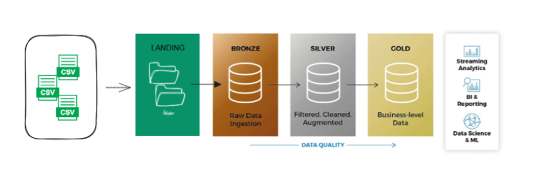

### README - Projeto de Lakehouse com Delta Lake, DuckDB e Azure Data Lake

## Objetivo do Projeto

O objetivo deste projeto é transformar um banco de dados originalmente modelado de forma relacional para uma modelagem dimensional, utilizando as camadas `bronze`, `silver` e `gold` do Delta Lake dentro do Azure Data Lake. Com isso, buscamos otimizar a estrutura dos dados para facilitar a análise e a criação de relatórios gerenciais.
<center>
    
</center>


Ferramentas utilizadas:
- **Delta Lake**: Formato de armazenamento otimizado para processamento de grandes volumes de dados.
- **DuckDB**: Banco de dados colunar em memória utilizado para consultas e transformações.
- **Azure Data Lake**: Armazenamento de dados escalável e seguro.
- **Python**: Linguagem de programação utilizada para a execução das ETLs.


## Estrutura do Projeto

O projeto segue uma arquitetura de camadas para organizar e processar os dados:
<center>
    
</center>

1. **Camada Landing**: Armazena os arquivos CSV originais recebidos do banco relacional, sem qualquer transformação.
2. **Camada Bronze**: Contém os dados brutos copiados da camada `Landing`, exatamente como foram recebidos, apenas em um formato mais adequado ao Delta Lake.
3. **Camada Silver**: Contém os dados processados e limpos, com algumas transformações básicas e regras de negócio aplicadas.
4. **Camada Gold**: Contém os dados estruturados em um modelo dimensional, com tabelas de fatos e dimensões, prontos para análise e relatórios.

## Origem Dados

Os dados utilizados no projeto provêm das seguintes entidades do banco de dados relacional original.


- brands: Informações sobre as marcas dos produtos.
- categories: Informações sobre as categorias de produtos.
- customers: Dados dos clientes, como nome, e-mail e endereço.
- products: Detalhes dos produtos, como nome, descrição e preço.
- staffs: Informações sobre os funcionários que realizaram vendas.
- stores: Dados das lojas onde as vendas ocorreram.
- order_items: Itens individuais em cada pedido, contendo informações como quantidade, preço e descontos aplicados.
- orders: Informações gerais sobre os pedidos, como data, cliente e status.
- stocks: Informações sobre o estoque de produtos em diferentes lojas.


## Modelagem Dimensional Proposta

Os dados utilizados no projeto provêm ser estrtuturados na seguinte modelagem.

## Scripts de ETL

Cada camada possui um script específico que realiza o processo de ETL (Extract, Transform, Load) de acordo com as características da camada:

1. **`ingestlanding.py`**: Responsável por copiar os arquivos CSV recebidos para a camada `Landing` no Azure Data Lake, sem qualquer transformação.
2. **`ingestbronze.py`**: Realiza a cópia dos dados da camada `Landing` para a camada `Bronze`, mantendo os dados brutos no formato Delta Lake.
3. **`ingestsilver.py`**: Aplica as primeiras transformações e regras de limpeza nos dados, estruturando-os de forma mais organizada e eliminando inconsistências.
4. **`ingestgold.py`**: Transforma os dados em um modelo dimensional, criando as tabelas de fatos e dimensões necessárias para facilitar a análise.
5. **`main.py`**: Script principal que orquestra a execução dos outros scripts, garantindo que o pipeline de ETL seja executado na ordem correta.

## Pré-requisitos

1. **Azure Data Lake Storage**: Crie uma conta de armazenamento no Azure e configure as credenciais necessárias.
2. **Python 3.7+**: Certifique-se de ter o Python instalado.
3. **Pacotes Python**: Instale os pacotes necessários com o comando:

    ```bash
    pip install deltalake duckdb pandas python-dotenv
    ```

4. **Arquivos CSV**: Certifique-se de que os arquivos CSV necessários para o projeto estejam disponíveis e acessíveis na pasta dados.

## Configuração do Ambiente

1. **Arquivo `.env`**: Crie um arquivo `.env` na raiz do projeto com as seguintes variáveis:

    ```
    AZURE_STORAGE_ACCOUNT_NAME=nome_da_conta_azure
    AZURE_STORAGE_ACCESS_KEY=chave_de_acesso
    AZURE_STORAGE_CLIENT_ID=client_id
    AZURE_STORAGE_CLIENT_SECRET=client_secret
    AZURE_STORAGE_TENANT_ID=tenant_id
    ```

2. **Estrutura de Diretórios**: Organize os diretórios conforme necessário:

    ```
    projeto/
    ├──  modules/
    │   ├── ingestlanding.py
    │   ├── ingestbronze.py
    │   ├── ingestsilver.py
    │   ├── ingestgold.py
    ├── data/
    ├── media/
    ├── main.py
    ├── .env
    └── README.md
    ```


## Execução do Projeto

1. **Main Script**: O script principal para execução é o `main.py`, localizado na pasta `app/`. Ele orquestra a execução de todas as camadas.
2. **Pipeline de ETL**: O pipeline de ETL é executado em quatro etapas principais:
   - **Landing**: Os dados são copiados para a camada `Landing` sem transformações.
   - **Bronze**: Os dados são carregados na camada `Bronze` no formato Delta.
   - **Silver**: Os dados são transformados e limpos.
   - **Gold**: Os dados são estruturados em um modelo dimensional, com tabelas de fatos e dimensões.

3. **Comando de Execução**:

    ```bash
    python main.py
    ```

## Detalhamento das Camadas

### Camada Landing

- Armazena os arquivos CSV recebidos do sistema original.
- Nenhuma transformação é realizada nesta camada.

### Camada Bronze

- Copia os dados brutos da camada Landin g para o Delta Lake.
- Mantém a integridade dos dados originais.

### Camada Silver

- Limpeza e transformação de dados.
- Regras de negócio básicas são aplicadas.
- Os dados são organizados em formato Parquet no Delta Lake.

### Camada Gold

- Os dados são estruturados em um modelo dimensional:
  - **Tabelas de Dimensão**: Informações descritivas como `dim_customers`, `dim_products`, `dim_stores`, etc.
  - **Tabela Fato**: Transações principais como `fact_sales` e `fact_stocks`.
- Modelagem e otimização para análise e geração de relatórios.

## Estrutura do Código

### `ingestlanding.py`

- Copia os arquivos CSV para a camada Landing no Azure Data Lake.

### `ingestbronze.py`

- Copia os dados da camada Landing para a camada Bronze, mantendo os dados brutos no formato Delta Lake.

### `ingestsilver.py`

- Realiza a limpeza e transformação dos dados, aplicando regras de negócio e criando um formato mais organizado.

### `ingestgold.py`

- Estrutura os dados em um modelo dimensional, criando as tabelas de fatos e dimensões.

### `main.py`

- Orquestra a execução dos outros scripts, garantindo a ordem correta de processamento.

## Considerações Finais

Este projeto demonstra como integrar diferentes tecnologias para construir um Lakehouse robusto e escalável, estruturando os dados em um formato de fácil análise. A flexibilidade do DuckDB combinada com a escalabilidade do Delta Lake e Azure Data Lake oferece uma solução eficiente para processamento e análise de grandes volumes de dados.

# Direitos de Uso
***
Este repositório têm como objetivo apresentar um projeto de estrutura de dados moderna em python. Então, dentro deste repositório você pode utilizar deste conteúdo sem nenhuma restrição contanto que não me responsebilize por eventuais causas ou danos morais perante minha responsabilidade.	

Exigido | Permitido | Proibido
:---: | :---: | :---:
Aviso de licença e direitos autorais | Uso comercial | Responsabilidade Assegurada
 || Modificação ||	
 || Distribuição ||	
 || Sublicenciamento || 